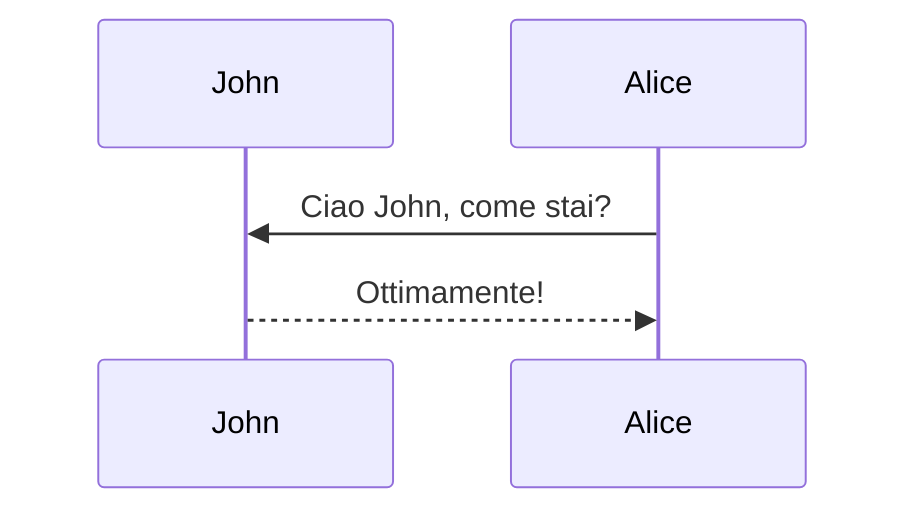

Questo tema supporta la generazione di vari diagrammi da una descrizione di testo usando [mermaid](https://mermaid-js.github.io/mermaid/){:target="\_blank"}. Precedentemente, questo veniva fatto usando il plugin [jekyll-diagrams](https://github.com/zhustec/jekyll-diagrams){:target="\_blank"}. Per maggiori informazioni a riguardo, vedere la [issue correlata](https://github.com/alshedivat/al-folio/issues/1609#issuecomment-1656995674). Per disabilitare la funzionalità di zoom, impostare `mermaid.zoomable` a `false` nel frontmatter di questo post.

## Mermaid

Il diagramma sottostante è stato generato dal seguente codice:

````markdown

````


